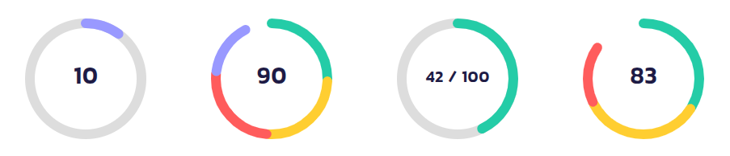

# React Multi-Segment Progress

A **flexible and reusable circular progress component** with multiple segments, customizable colors, and a smooth UI. Ideal for visualizing segmented progress bars with gaps and labels inside the circle.

[](https://github.com/ehsanmolaei991/react-multi-segment-circle-progress/raw/main/assets/examples.png)

---

## 🚀 Installation

Install the package via npm or yarn:

```sh
npm install react-multi-segment-circle-progress
```

or

```sh
yarn add react-multi-segment-circle-progress
```

---

## 🔧 Usage

Import and use the `MultiSegmentAuto` component in your project:

```tsx
import React from "react";
import { MultiSegmentAuto } from "react-multi-segment-circle-progress";

const App = () => {
  return (
    <MultiSegmentAuto
      size={150}
      strokeWidth={12}
      totalValue={80}
      maxValue={100}
      segmentsCount={4}
      segmentColors={["#24CCA7", "#FFCE31", "#FF5C5C", "#9999FF"]}
      gap={3}
      label={80}
      showBackgroundCircle
      backgroundCircleColor="#eee"
    />
  );
};

export default App;
```

---

## 🎨 Examples

### 1️⃣ **Basic Usage**


```tsx
<MultiSegmentAuto
  size={120}
  totalValue={60}
  segmentsCount={3}
  segmentColors={["#FF0000", "#00FF00", "#0000FF"]}
/>
```

### 2️⃣ **With Gaps & Custom Stroke Width**


```tsx
<MultiSegmentAuto
  size={180}
  strokeWidth={15}
  totalValue={90}
  segmentsCount={5}
  gap={5}
  segmentColors={["#FFD700", "#DC143C", "#32CD32", "#1E90FF", "#8A2BE2"]}
/>
```

### 3️⃣ **With Custom Label**


```tsx
<MultiSegmentAuto
  size={150}
  totalValue={70}
  label={<span style={{ fontSize: "20px", fontWeight: "bold" }}>70%</span>}
/>
```

### 4️⃣ **With Background Circle**

```tsx
<MultiSegmentAuto
  size={150}
  strokeWidth={12}
  totalValue={42}
  maxValue={100}
  showBackgroundCircle={true}
  backgroundCircleColor="#ddd"
  label={<b>42 / 100</b>}
/>
```

---

## 🎛️ Props

| Prop | Type | Default | Description |
|------|------|---------|-------------|
| `size` | `number` | `120` | Diameter of the circle (px) |
| `strokeWidth` | `number` | `10` | Thickness of the progress stroke |
| `totalValue` | `number` | `80` | The current value of the progress |
| `maxValue` | `number` | `100` | The maximum value for progress calculation |
| `segmentsCount` | `number` | `4` | Number of segments in the progress circle |
| `segmentColors` | `string[]` | `[#24CCA7, #FFCE31, #FF5C5C, #9999FF]` | Colors for each segment |
| `gap` | `number` | `2` | Gap size between segments (px) |
| `label` | `React.ReactNode` | `""` | Custom label in the center of the circle |
| `outerPadding` | `number` | `0` | Padding between SVG boundary and outermost stroke |
| `innerPadding` | `number` | `0` | Padding inside the progress ring |
| `strokeLinecap` | `"butt" \| "round" \| "square"` | `"round"` | Shape of segment ends |
| `showBackgroundCircle` | `boolean` | `false` | Show a background track circle |
| `backgroundCircleColor` | `string` | `"#ddd"` | Color of the background track |
| `className` | `string` | `""` | Custom class for styling |
| `style` | `React.CSSProperties` | `{}` | Inline styles for the SVG |
| `onClick` | `function` | `undefined` | Click event handler |
| `onMouseEnter` | `function` | `undefined` | Mouse enter event handler |
| `onMouseLeave` | `function` | `undefined` | Mouse leave event handler |

---

## 📌 Notes

- Ensure `totalValue <= maxValue` to avoid unexpected behavior.
- `segmentColors` will cycle through if there are fewer colors than segments.
- Use `strokeLinecap="round"` for smooth segment ends.
- The `label` prop accepts **text or JSX elements**, so you can pass icons, numbers, or custom designs.

---

## 🌎 Links

- **GitHub Repository:** [github.com/react-multi-segment-circle-progress](https://github.com/ehsanmolaei991/react-multi-segment-circle-progress)
- **NPM Package:** [npmjs.com/package/react-multi-segment-circle-progress](https://npmjs.com/package/react-multi-segment-circle-progress)

---

## 📜 License

MIT © 2025 ehsanmolaei991

